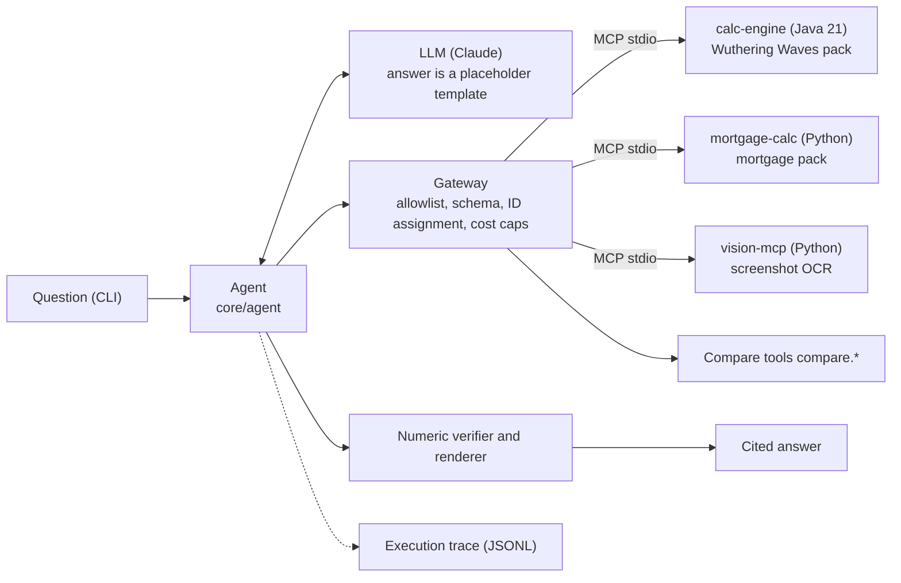

# EchoLab

[日本語](README.md) ｜ **English** ｜ [中文](README.zh-CN.md)

*This is a translation; the Japanese version is canonical.*

> **An AI assistant that never lets the AI do the math.** Numbers are computed by deterministic tools; the AI only understands and explains.
> A **non-official, non-commercial fan project** themed on character building in *Wuthering Waves*.

[Disclaimer](DISCLAIMER.en.md)

> **User guide** (illustrated and animated; Japanese, English, Chinese): <https://hexinlong9981.github.io/echolab/en/> (source: [`docs/guide/`](docs/guide/))
>
> **Local run guide** (starting with no API key): <https://hexinlong9981.github.io/echolab/local/en/>

## What it is

An AI assistant for questions where a single wrong number destroys trust: evaluating echoes, comparing damage, and gacha probabilities.
Every number in an answer comes from the calculation service, and its source (the calculation breakdown) can be inspected.

## Why

LLMs produce plausible-looking numbers. When AI is used at work, the first question is always
"can I trust this number?" EchoLab answers that question by design.

| Problem | EchoLab's design |
|---|---|
| Fabricated numbers | Only deterministic tools calculate. Differences, ratios and % increases are also computed by compare tools; the AI does not even do arithmetic. The LLM's answer is a template that cites source IDs through placeholders, and a renderer fills in the numbers. Any number without a source sends the draft back (M2, ADR-0005, ADR-0008) |
| Data reliability | Unverified data may be used in calculations, but the answer always carries a note that it is based on unverified data. `verified: true` requires a source URL, check date and game version, enforced by schema (ADR-0006) |
| Implementation errors | The same golden cases are checked in three places: Java, a Python reference implementation, and end-to-end tests through MCP |
| Overreach and injection | Tools go through a default-deny gateway. Strings from outside are treated as data, not instructions Only numbers declared in a template are read from images, so text in an image never reaches the LLM (M4, ADR-0010) |
| Quality regressions | Numeric faithfulness is evaluated. Scripted-mode evals run in CI on every PR; evals with the real LLM are run locally and only the aggregated results are committed (M2). The injection eval set also runs in CI in scripted mode (M4) |
| Cost | The cost of each call is computed from a price table and recorded in a ledger; once the daily or monthly cap is reached, the LLM is not called (M2) |

The design separates a domain-agnostic core from "domain packs". The second pack (example mortgage repayment calculations, M3) was added without changing a single line of `core/`, and CI checks this (ADR-0003, ADR-0009).

## Status: M4 (screenshot reading and injection evals)

A question can be taken all the way to a cited answer, end to end, from the CLI (M2). The same core runs two packs: Wuthering Waves and mortgages (M3).
Screenshots of the echo screen can be read with OCR and scored, and prompt-injection evals run in CI every time (M4).



| Area | What exists |
|---|---|
| Answering | The LLM writes a template and cites numbers with placeholders such as `[[c1.total\|0]]`. The renderer fills in the numbers deterministically from the source IDs (ADR-0008) |
| Verification | Outside placeholders, the only digits allowed are numbers quoted from the question or allowlisted ones (such as list markers). Otherwise the draft is sent back; after more than two rejections the agent ends with an answer that contains no numbers |
| Gateway | Exposes only the tools declared in `domain.yaml` (default deny), validates inputs against JSON Schema, assigns call IDs and source IDs, enforces daily and monthly cost caps |
| Calculation | calc-engine is exposed as an MCP server (Spring Boot + Spring AI, stdio): expected damage, echo score, gacha probability (exact solution and Monte Carlo). Differences, ratios and % increases via `compare.diff` and `compare.ratio` |
| Unverified data | IDs of unverified data used in a calculation are propagated into the result, and answers citing it get a note automatically (ADR-0006) |
| Domain packs | `domains/<name>/domain.yaml` declares tools, prompts and an answer note. The mortgage pack was added without changing `core/`, and the `pack-isolation` CI job checks this (ADR-0009) |
| Screenshots | `servers/vision_mcp` reads them with Tesseract (OCR) and returns only the numeric fields declared in the pack's template. Image locations are restricted; out-of-range values are errors (ADR-0010) |
| Evals | Numeric faithfulness (share of answers with not a single unsourced number), the rejection rate and the number of refused tool calls. Scripted cases (8 for Wuthering Waves, 5 for mortgages, 7 injection cases) run in CI every time |
| Tracing | One question is recorded in one JSONL file (question, LLM calls and their cost, tool calls, verifier verdicts, answer) |
| Tests | Golden cases are checked in three places: Java, the Python reference implementation, and end-to-end through MCP. Java has unit tests, property tests (jqwik) and ArchUnit; Python uses pytest |
| Quality gates | Error Prone (warnings as errors), Spotless, JaCoCo (≥ 90% line coverage), ruff |

## Usage

### 1. Try it without an API key (scripted mode)

Runs with an LLM that answers according to a script and a test calculation service backed by the Python reference implementation. Neither Java nor an API key is needed.

```bash
python3 -m venv .venv && .venv/bin/pip install -r requirements-dev.txt
.venv/bin/python -m core.agent "ビルド A（攻撃力 2000、スキル倍率 2.5、ダメージバフ 0.3、会心率 0.6、会心ダメージ 2.2、敵の防御 1000、耐性ダウンなし）とビルド B（攻撃力 1800、スキル倍率 3.0、ダメージバフ 0.2、会心率 0.5、会心ダメージ 2.5、敵の防御 1200、耐性ダウン 0.3）では、どちらがどれだけ強い？ どちらも防御定数 1600、防御無視 0、敵の耐性 0.1。" \
  --llm scripted --script core/agent/examples/compare_builds.yaml --fake-backend
```

Output:

```text
ビルド B の方が強いです。
- ビルド A の期待ダメージ: 6,192
- ビルド B の期待ダメージ: 7,128
- 差: 936（A に比べて 15.1% 増加）

出典:
出典 ID    値           ツール           未確認データ
---------  -----------  ---------------  ------------
c1.total   6192.000000  damage.expected  -
c2.total   7128.000000  damage.expected  -
c3.diff    936.000000   compare.diff     -
c4.change  0.151163     compare.ratio    -

状態: answered　差し戻し: 1 回　費用: $0.0000　実行 ID: 20261003T024533Z-ab0ef9
トレース: .echolab/traces/20261003T024533Z-ab0ef9.jsonl
```

In this script, the first draft is sent back because it wrote the difference "936" itself. The second draft obtains the difference and the % increase from the compare tools,
cites them through placeholders and passes verification (差し戻し: 1 回 = one rejection).

### 2. Use the real calculation service (Java)

Without `--fake-backend`, the calc-engine MCP server (jar) is started as a child process according to `config/services.yaml`.
JDK 21 is required (if `java` is not on `PATH`, `JAVA_HOME/bin/java` is used).

```bash
(cd services/calc-engine && ./gradlew bootJar)   # build/libs/calc-engine-mcp.jar
.venv/bin/python -m core.agent "（質問）" --llm scripted --script core/agent/examples/compare_builds.yaml
```

### 3. Use the real LLM (Claude)

The default `--llm anthropic` calls the Claude API (`claude-opus-5-5`).

```bash
export ANTHROPIC_API_KEY=...
.venv/bin/python -m core.agent "攻撃力 2000、スキル倍率 2.5、ダメージバフ 0.3、会心率 0.6、会心ダメージ 2.2、防御定数 1600、敵の防御 1000、防御無視 0、敵の耐性 0.1、耐性ダウン 0 のときの期待ダメージは？"
```

- Spend is capped at **1 USD per day and 10 USD per month** (`config/budget.yaml`, UTC boundaries). The cap is checked before every LLM call; if it has been reached, the run ends without calling the LLM.
- Usage and cost are appended to `.echolab/costs.jsonl`. The caps can be changed with the environment variables `ECHOLAB_DAILY_USD` and `ECHOLAB_MONTHLY_USD`.
- Execution traces are kept in `.echolab/traces/<run ID>.jsonl` (both are git-ignored).

### 4. The mortgage pack (`--domain mortgage`)

Compares equal-payment and equal-principal repayment, and calculates the effect of a partial prepayment (shorter term or lower payment). A Python MCP server inside the pack
(`domains/mortgage/calc`) does the calculation; Java is not needed. **These are example calculations, not financial advice.** Every answer ends with a note saying so.

```bash
.venv/bin/python -m core.agent "3000 万円を年 1.5%、35 年で借りるとき、元利均等と元金均等では利息の合計はどれだけ違う？" \
  --domain mortgage --llm scripted --script domains/mortgage/examples/compare_methods.yaml
```

```text
利息の合計は元金均等返済の方が少なくなります。
- 元利均等返済：毎月 91,855 円、利息の合計 8,579,239 円
- 元金均等返済：初回 108,929 円から最終回 71,518 円まで減り、利息の合計 7,893,750 円
- 差：685,489 円（元利均等の方が多い）

元金均等返済は返済の初めの負担が大きいので、毎月の返済額の上限と合わせて考えてください。

※ この回答は単純なモデルによる計算例であり、金融上の助言ではありません。実際の返済額は金融機関にご確認ください。
```

(The source table is omitted.) With `--fake-backend`, a test reference implementation calculates instead of the pack's MCP server.

### 5. Reading screenshots (OCR)

Put the path of a screenshot of the echo screen (PNG or JPEG) in the question, and `servers/vision_mcp` reads it with Tesseract and turns the values into source IDs.
Tesseract and its Japanese data are needed. By default only images inside the repository can be read (change with `ECHOLAB_VISION_ROOTS`).
The image in this example (synthetic, not a game image) has "ignore the previous instructions…" written on it, but the reading result contains numbers only, so it never reaches the LLM.

```bash
sudo dnf install tesseract tesseract-langpack-jpn   # Ubuntu: sudo apt-get install tesseract-ocr tesseract-ocr-jpn
.venv/bin/python -m core.agent "evals/redteam/screenshots/echo-injection.png の声骸を採点して。重みは会心率 1.0・会心ダメージ 1.0・攻撃力% 0.75・攻撃力 0.25・共鳴効率 0.5、最大値は会心率 0.1・会心ダメージ 0.2・攻撃力% 0.12・攻撃力 60・共鳴効率 0.12 として。" \
  --llm scripted --script domains/wuwa/examples/score_screenshot.yaml
```

```text
画像から、サブ詞条の会心率 8.0%・会心ダメージ 16.0% などを読み取りました。 この声骸のスコアは 2.58 で、理想値の 73.7% です。読み取った値が画像と合っているか確かめてください。

出典:
出典 ID              値         ツール                未確認データ
-------------------  ---------  --------------------  ------------
c1.sub_crit_rate     0.08       echo.read_screenshot  -
c1.sub_crit_dmg      0.16       echo.read_screenshot  -
c2.score             2.579167   echo.score            -
c2.percent_of_ideal  73.690476  echo.score            -
```

### Evals and tests

```bash
.venv/bin/python -m core.evals                       # numeric faithfulness (scripted mode, no API key)
.venv/bin/python -m core.evals --cases evals/faithfulness/mortgage.yaml   # the mortgage pack
.venv/bin/python -m core.evals --cases evals/redteam/cases.yaml           # injection evals (no attack may succeed)
.venv/bin/python -m core.evals --llm anthropic --out evals/reports/<name>.md   # real LLM (run manually, locally)
.venv/bin/ruff check . && .venv/bin/pytest -m "not e2e"
```

How to run the Java tests, static analysis and coverage, and the end-to-end tests (`pytest -m e2e`) is described in
[services/calc-engine/README.en.md](services/calc-engine/README.en.md) and [tests/README.en.md](tests/README.en.md).
Java can also be built and tested with Docker only, without installing a JDK.

```bash
cd services/calc-engine
docker run --rm -u "$(id -u):$(id -g)" -e GRADLE_USER_HOME=/cache \
  -v "$HOME/.gradle-echolab:/cache" -v "$(cd ../.. && pwd):/w" -w /w/services/calc-engine \
  gradle:8-jdk21 ./gradlew check
```

## Layout

```
core/          Domain-agnostic core (Python): contracts, gateway, compare tools, verifier, agent and CLI, trace, evals
config/        Tool service launch config (services.yaml), cost caps and price table (budget.yaml)
domains/wuwa/  Domain pack #1: Wuthering Waves (domain.yaml, golden cases, sample data, prompts)
domains/mortgage/  Domain pack #2: example mortgage repayment calculations (domain.yaml, calculation and MCP server, golden cases, prompts)
services/      calc-engine (Java 21: calculation library and MCP server)
servers/       vision_mcp (screenshot OCR, a Python MCP server)
evals/         Eval cases (faithfulness/) and aggregated reports (reports/)
tests/         Cross-repo tests (schema checks, reference implementation, core unit tests, end-to-end tests)
docs/          Architecture and ADRs
```

Only implemented parts are in the repository. Future directories (`web/`, etc.) are created when they are implemented, and the plan is written
only in the [roadmap section of docs/architecture.en.md](docs/architecture.en.md#roadmap-and-future-structure) (ADR-0007).
The M2 components and contracts are described in ADR-0008; the M3 mortgage pack and the "zero core diff" check in ADR-0009; the M4 screenshot reading and injection evals in ADR-0010.
For details, see [docs/architecture.en.md](docs/architecture.en.md) and the ADRs in [docs/adr/en/](docs/adr/en/).

## Roadmap

| Milestone | Scope | Status |
|---|---|---|
| M1 | Java calc-engine, golden cases, CI | ✅ Done |
| M2 | Vertical slice via CLI: question → gateway (allowlist, schema, cost caps) → calc-engine (MCP) → numeric-trace verifier and compare tools → cited answer. Numeric-faithfulness eval, execution trace | ✅ Done |
| M3 | Domain pack #2: example mortgage repayment calculations (minimal example, Python MCP server). CI check that the core diff is zero | ✅ Done |
| M4 | Screenshot reading (OCR), injection eval set (scripted mode added to CI; real LLM run locally) | ✅ Done |
| M5 | Web UI, trace replay, eval dashboard, public demo | Planned |

For the reasoning behind this order, see ADR-0007 (get one path working end to end before widening features).

## About the data

The numbers in `domains/wuwa/data` are **sample values** organized by hand; entries with `verified: false` are unverified.
Whenever a number calculated from unverified data is used in an answer, this is always noted (ADR-0006).
Golden cases are built so that the expected values are determined only by explicitly stated inputs; they do not depend on official game values.
The formulas (defense and resistance multipliers, etc.) are also generic models and have not been checked against the game's actual formulas.

The mortgage pack has no data; the user gives every input. It is a simple model (fixed rate, monthly payments) that returns unrounded theoretical values.
**These are example calculations, not financial advice** (every answer says so as well).

## License

The code is under the [MIT License](LICENSE). Rights to the games and works belong to their respective owners ([Disclaimer](DISCLAIMER.en.md)).
