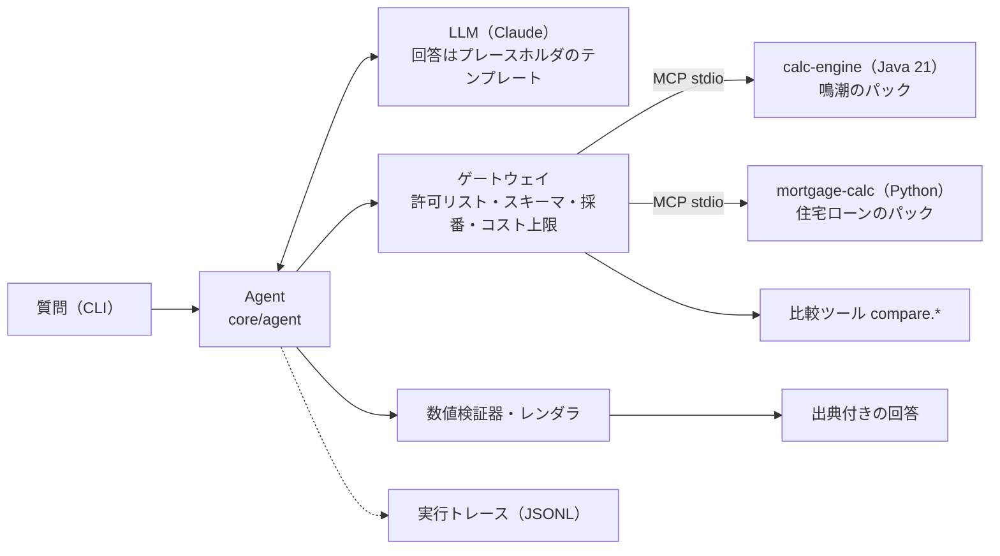

# EchoLab

**日本語** ｜ [English](README.en.md) ｜ [中文](README.zh-CN.md)

> **AI に計算させない AI アシスタント。** 数値は決定的なツールで計算し、AI は理解と説明だけを担当します。
> 『鳴潮（Wuthering Waves）』の育成を題材にした、**非公式・非営利のファン作品**です。

[免責事項](DISCLAIMER.md)

> **利用ガイド**（図解・アニメーション付き、日本語・英語・中国語）：<https://hexinlong9981.github.io/echolab/ja/>（ソース：[`docs/guide/`](docs/guide/)）
>
> **ローカル実行ガイド**（API キーなしで動かす手順から）：<https://hexinlong9981.github.io/echolab/local/ja/>

## これは何か

声骸（エコー）の評価、ダメージの比較、ガチャの確率といった「数値が 1 つ間違うと信頼を失う」質問に答える AI アシスタントです。
回答に出る数値は、すべて計算サービスの結果に由来し、出典（計算の明細）を確認できます。

## なぜ作ったか

LLM はもっともらしい数値を作ってしまいます。業務で AI を使うときに一番問われるのも
「その数字は信用できるのか」です。EchoLab はこれに設計で答えます。

| 課題 | EchoLab の設計 |
|---|---|
| 数値の捏造 | 計算は決定的なツールだけが行う。差・比・増加率も比較ツールで計算し、AI は四則演算もしない。LLM の回答はプレースホルダで出典 ID を引用するテンプレートで、数値はレンダラが埋める。出典の無い数字があれば差し戻す（M2・ADR-0005・ADR-0008） |
| データの確かさ | 未確認のデータも計算には使えるが、回答に「未確認のデータに基づく」と必ず注記する。`verified: true` には出典 URL・確認日・ゲームの版をスキーマで必須にする（ADR-0006） |
| 実装の誤り | 同じゴールデンケースを Java・Python の参照実装・MCP 経由の端から端までの試験の 3 か所で照合する |
| 越権・注入 | ツールは既定拒否のゲートウェイを通す。外部から来た文字列は指示ではなくデータとして扱う（ゲートウェイは M2 で実装済み、注入の評価セットは M4） |
| 品質の後退 | 数値の忠実度を評価する。台本モードの評価は CI で PR ごとに流し、実物の LLM による評価は手元で実行して集計結果だけをコミットする（M2。注入の評価セットは M4） |
| コスト | 料金表から 1 回ごとの費用を計算して台帳に記録し、日次・月次の上限に達したら LLM を呼ばない（M2） |

ドメインに依存しないコアと「ドメインパック」に分ける設計です。2 つ目のパック（住宅ローンの返済の計算例、M3）は `core/` を 1 行も変えずに足し、そのことを CI で検査しています（ADR-0003・ADR-0009）。

## 現在の状態：M3（2 つ目のドメインパック）

質問から出典付きの回答までを、CLI で端から端まで通せます（M2）。同じコアで、鳴潮と住宅ローンの 2 つのパックが動きます（M3）。



| 項目 | 内容 |
|---|---|
| 回答 | LLM はテンプレートを書き、数値はプレースホルダ `[[c1.total\|0]]` で引用する。数値はレンダラが出典 ID から決定的に埋める（ADR-0008） |
| 検証 | プレースホルダ以外の数字は、質問にある数値の引用か許可リスト（箇条書きの番号など）だけを許す。合わなければ差し戻し、2 回を超えたら数値を含まない回答で終える |
| ゲートウェイ | `domain.yaml` に宣言したツールだけを見せる（既定拒否）・入力の JSON Schema 検証・呼び出し ID と出典 ID の採番・日次・月次のコスト上限 |
| 計算 | calc-engine を MCP サーバ（Spring Boot + Spring AI、stdio）として公開。期待ダメージ・声骸スコア・ガチャ確率（厳密解とモンテカルロ法）。差・比・増加率は `compare.diff`・`compare.ratio` |
| 未確認データ | 計算に使った未確認データの ID を結果に伝搬し、引用した回答には注記を自動で付ける（ADR-0006） |
| ドメインパック | `domains/<名前>/domain.yaml` でツール・プロンプト・回答の注記を宣言する。住宅ローンのパックは `core/` を変えずに追加し、CI の `pack-isolation` がそれを検査する（ADR-0009） |
| 評価 | 数値の忠実度（出典の無い数値を 1 つも含まない回答の割合）と差し戻し率。台本モードのケース（鳴潮 8 件・住宅ローン 5 件）を CI で毎回実行 |
| トレース | 1 回の質問を 1 つの JSONL に記録（質問・LLM 呼び出しと費用・ツール呼び出し・検証の判定・回答） |
| テスト | ゴールデンケースを Java・Python の参照実装・MCP 経由の端から端までの試験の 3 か所で照合。Java は単体・性質テスト（jqwik）・ArchUnit、Python は pytest |
| 品質ゲート | Error Prone（警告はエラー）・Spotless・JaCoCo（行カバレッジ 90% 以上）・ruff |

## 使い方

### 1. API キーなしで試す（台本モード）

台本どおりに応答する LLM と、Python の参照実装で計算する試験用の計算サービスで動きます。Java も API キーも要りません。

```bash
python3 -m venv .venv && .venv/bin/pip install -r requirements-dev.txt
.venv/bin/python -m core.agent "ビルド A（攻撃力 2000、スキル倍率 2.5、ダメージバフ 0.3、会心率 0.6、会心ダメージ 2.2、敵の防御 1000、耐性ダウンなし）とビルド B（攻撃力 1800、スキル倍率 3.0、ダメージバフ 0.2、会心率 0.5、会心ダメージ 2.5、敵の防御 1200、耐性ダウン 0.3）では、どちらがどれだけ強い？ どちらも防御定数 1600、防御無視 0、敵の耐性 0.1。" \
  --llm scripted --script core/agent/examples/compare_builds.yaml --fake-backend
```

出力：

```text
ビルド B の方が強いです。
- ビルド A の期待ダメージ: 6,192
- ビルド B の期待ダメージ: 7,128
- 差: 936（A に比べて 15.1% 増加）

出典:
出典 ID    値           ツール           未確認データ
---------  -----------  ---------------  ------------
c1.total   6192.000000  damage.expected  -
c2.total   7128.000000  damage.expected  -
c3.diff    936.000000   compare.diff     -
c4.change  0.151163     compare.ratio    -

状態: answered　差し戻し: 1 回　費用: $0.0000　実行 ID: 20261003T024533Z-ab0ef9
トレース: .echolab/traces/20261003T024533Z-ab0ef9.jsonl
```

この台本の 1 回目の下書きは、差「936」を自分で書いたため差し戻されます。2 回目は比較ツールで差と増加率を求め、
プレースホルダで引用して検証に通ります（差し戻し: 1 回）。

### 2. 実物の計算サービス（Java）を使う

`--fake-backend` を外すと、`config/services.yaml` に従って calc-engine の MCP サーバ（jar）を子プロセスとして起動します。
JDK 21 が必要です（`java` が PATH に無ければ `JAVA_HOME/bin/java` を使います）。

```bash
(cd services/calc-engine && ./gradlew bootJar)   # build/libs/calc-engine-mcp.jar
.venv/bin/python -m core.agent "（質問）" --llm scripted --script core/agent/examples/compare_builds.yaml
```

### 3. 実物の LLM（Claude）を使う

既定の `--llm anthropic` は Claude API（`claude-opus-5-5`）を呼びます。

```bash
export ANTHROPIC_API_KEY=...
.venv/bin/python -m core.agent "攻撃力 2000、スキル倍率 2.5、ダメージバフ 0.3、会心率 0.6、会心ダメージ 2.2、防御定数 1600、敵の防御 1000、防御無視 0、敵の耐性 0.1、耐性ダウン 0 のときの期待ダメージは？"
```

- コストの上限は**日次 1 USD・月次 10 USD**（`config/budget.yaml`、UTC で区切る）。LLM を呼ぶ前に毎回確かめ、上限に達していれば呼ばずに終了します。
- 使用量と金額は `.echolab/costs.jsonl` に追記します。上限は環境変数 `ECHOLAB_DAILY_USD`・`ECHOLAB_MONTHLY_USD` で変えられます。
- 実行トレースは `.echolab/traces/<実行 ID>.jsonl` に残ります（どちらも Git の管理外）。

### 4. 住宅ローンのパック（`--domain mortgage`）

元利均等・元金均等の比較と、繰上返済（期間短縮型・返済額軽減型）の効果を計算します。計算はパックの中の Python の MCP サーバ
（`domains/mortgage/calc`）が行い、Java は要りません。**計算例であり、金融上の助言ではありません**。回答の末尾にはその旨の注記を必ず付けます。

```bash
.venv/bin/python -m core.agent "3000 万円を年 1.5%、35 年で借りるとき、元利均等と元金均等では利息の合計はどれだけ違う？" \
  --domain mortgage --llm scripted --script domains/mortgage/examples/compare_methods.yaml
```

```text
利息の合計は元金均等返済の方が少なくなります。
- 元利均等返済：毎月 91,855 円、利息の合計 8,579,239 円
- 元金均等返済：初回 108,929 円から最終回 71,518 円まで減り、利息の合計 7,893,750 円
- 差：685,489 円（元利均等の方が多い）

元金均等返済は返済の初めの負担が大きいので、毎月の返済額の上限と合わせて考えてください。

※ この回答は単純なモデルによる計算例であり、金融上の助言ではありません。実際の返済額は金融機関にご確認ください。
```

（出典の表は省略。）`--fake-backend` を付けると、パックの MCP サーバの代わりに試験用の参照実装で計算します。

### 評価とテスト

```bash
.venv/bin/python -m core.evals                       # 数値の忠実度（台本モード、API キー不要）
.venv/bin/python -m core.evals --cases evals/faithfulness/mortgage.yaml   # 住宅ローンのパック
.venv/bin/python -m core.evals --llm anthropic --out evals/reports/<名前>.md   # 実物の LLM（手元で手動実行）
.venv/bin/ruff check . && .venv/bin/pytest -m "not e2e"
```

Java のテスト・静的解析・カバレッジと、端から端までの試験（`pytest -m e2e`）の実行方法は
[services/calc-engine/README.md](services/calc-engine/README.md) と [tests/README.md](tests/README.md) にあります。
JDK を入れずに Docker だけで Java をビルド・テストすることもできます。

```bash
cd services/calc-engine
docker run --rm -u "$(id -u):$(id -g)" -e GRADLE_USER_HOME=/cache \
  -v "$HOME/.gradle-echolab:/cache" -v "$(cd ../.. && pwd):/w" -w /w/services/calc-engine \
  gradle:8-jdk21 ./gradlew check
```

## 構成

```
core/          ドメイン非依存のコア（Python）：契約・ゲートウェイ・比較ツール・検証器・Agent と CLI・トレース・評価
config/        ツールサービスの起動方法（services.yaml）・コスト上限と料金表（budget.yaml）
domains/wuwa/  ドメインパック①：鳴潮（domain.yaml・ゴールデンケース・サンプルデータ・プロンプト）
domains/mortgage/  ドメインパック②：住宅ローンの返済の計算例（domain.yaml・計算と MCP サーバ・ゴールデンケース・プロンプト）
services/      calc-engine（Java 21。計算ライブラリと MCP サーバ）
evals/         評価ケース（faithfulness/）と集計済みのレポート（reports/）
tests/         リポジトリ横断のテスト（スキーマ検査・参照実装・core の単体テスト・端から端までの試験）
docs/          アーキテクチャと ADR
```

実装済みの部分だけを置いています。今後の構成（`servers/`・`web/` など）は実装するときに作り、計画は
[docs/architecture.md のロードマップ](docs/architecture.md#ロードマップと今後の構成)にだけ書きます（ADR-0007）。
M2 の部品と契約は [ADR-0008](docs/adr/0008-M2の構成と契約.md)、M3 の住宅ローンのパックと「コアの差分ゼロ」の検査は [ADR-0009](docs/adr/0009-住宅ローンのパックとコアの差分ゼロ.md) にあります。
詳しくは [docs/architecture.md](docs/architecture.md) と [docs/adr/](docs/adr/) を参照してください。

## ロードマップ

| 段階 | 内容 | 状態 |
|---|---|---|
| M1 | Java calc-engine・ゴールデンケース・CI | ✅ 完了 |
| M2 | 縦の切片：CLI で「質問 → ゲートウェイ（許可リスト・スキーマ・コスト上限）→ calc-engine（MCP）→ 数値トレース検証器・比較ツール → 出典付きの回答」。数値の忠実度の評価・実行トレース | ✅ 完了 |
| M3 | ドメインパック②：住宅ローンの返済の計算例（最小例・Python の MCP サーバ）。「コアの差分ゼロ」を CI で検査 | ✅ 完了 |
| M4 | スクリーンショット読み取り・注入の評価セット（台本モードで CI に追加、実物の LLM では手元で実行） | 予定 |
| M5 | Web UI・トレース再生・評価ダッシュボード・デモ公開 | 予定 |

順序の理由は ADR-0007（機能を横に広げる前に、端から端までを先に通す）を参照してください。

## データについて

`domains/wuwa/data` の数値は手作業で整理する**サンプル値**で、`verified: false` のものは未確認です。
未確認のデータから計算した数値を回答に使うときは、その旨を必ず注記します（ADR-0006）。
ゴールデンケースは明示した入力値だけで期待値が決まるように作ってあり、ゲームの公式数値には依存しません。
計算式（防御・耐性の乗区など）も汎用のモデルで、ゲームの実際の式とは確認していません。

住宅ローンのパックはデータを持たず、入力はすべて利用者が与えます。固定金利・毎月払いの単純なモデルで、円未満を丸めない理論値です。
**計算例であり、金融上の助言ではありません**（回答にも必ず表示します）。

## ライセンス

コードは [MIT License](LICENSE) です。ゲーム・作品に関する権利は各権利者に帰属します（[免責事項](DISCLAIMER.md)）。
