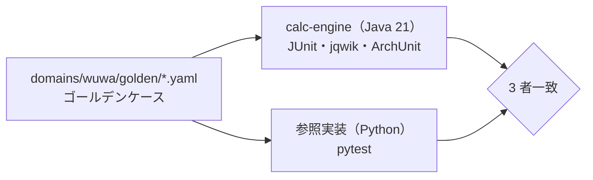

# EchoLab

> **AI に計算させない AI アシスタント。** 数値は決定的なツールで計算し、AI は理解と説明だけを担当します。
> 『鳴潮（Wuthering Waves）』の育成を題材にした、**非公式・非営利のファン作品**です。

[English](README.en.md) ・ [免責事項](DISCLAIMER.md)

## これは何か

声骸（エコー）の評価、ダメージの比較、ガチャの確率といった「数値が 1 つ間違うと信頼を失う」質問に答える AI アシスタントです。
回答に出る数値は、すべて計算サービスの結果に由来し、出典（計算の明細）を確認できます。

## なぜ作ったか

LLM はもっともらしい数値を作ってしまいます。業務で AI を使うときに一番問われるのも
「その数字は信用できるのか」です。EchoLab はこれに設計で答えます。

| 課題 | EchoLab の設計 |
|---|---|
| 数値の捏造 | 計算は決定的なツールだけが行う。差・比・増加率も比較ツールで計算し、AI は四則演算もしない。回答中の数値は出典 ID でツール結果と照合し、合わなければ差し戻す（M2・ADR-0005） |
| データの確かさ | 未確認のデータも計算には使えるが、回答に「未確認のデータに基づく」と必ず注記する。`verified: true` には出典 URL・確認日・ゲームの版をスキーマで必須にする（ADR-0006） |
| 実装の誤り | 同じゴールデンケースを Java と Python の 2 実装で照合する（M1 で実装済み） |
| 越権・注入 | ツールは既定拒否のゲートウェイを通す。外部から来た文字列は指示ではなくデータとして扱う（ゲートウェイは M2、注入の評価セットは M4） |
| 品質の後退 | 数値の忠実度の評価を M2 から測り、評価セットを PR ごとに流す（M4） |
| コスト | トークン構成からコストモデルを作り、日次・月次の上限（M2 のゲートウェイ）と録画済み回答への切替で最悪値を封じる |

ドメインに依存しないコアと「ドメインパック」に分ける設計で、題材を住宅ローン試算（M3）などに替えても、コアは変わりません（ADR-0003）。

## 現在の状態：M1（計算サービス）



| 項目 | 内容 |
|---|---|
| 計算 | 期待ダメージ（乗区ごとの明細）・声骸スコア・ガチャ確率（厳密解とモンテカルロ法） |
| テスト | 単体・性質テスト（jqwik）・契約テスト・アーキテクチャテスト（ArchUnit）・方式間の一致 |
| 契約 | ゴールデンケース（各ケースに導出方法 `derivation` を記録）・`domain.yaml`・データの JSON Schema 検査 |
| 品質ゲート | Error Prone（警告はエラー）・Spotless・JaCoCo（行カバレッジ 90% 以上）・ruff |
| 性能 | モンテカルロ法を逐次・parallel stream・仮想スレッドで実装し、JMH で比較 |

## クイックスタート

JDK を入れなくても Docker だけで動きます。

```bash
# Java：テスト・静的解析・カバレッジ
cd services/calc-engine
docker run --rm -u "$(id -u):$(id -g)" -e GRADLE_USER_HOME=/cache \
  -v "$HOME/.gradle-echolab:/cache" -v "$(cd ../.. && pwd):/w" -w /w/services/calc-engine \
  gradle:8-jdk21 ./gradlew check

# Python：スキーマ検査と参照実装による照合
cd ../..
python3 -m venv .venv && .venv/bin/pip install -r requirements-dev.txt
.venv/bin/ruff check . && .venv/bin/pytest
```

## 構成

```
domains/wuwa/  ドメインパック①：鳴潮（domain.yaml・ゴールデンケース・サンプルデータ）
services/      calc-engine（Java 21）
tests/         リポジトリ横断のテスト（スキーマ検査・Python 参照実装）
docs/          アーキテクチャと ADR
```

実装済みの部分だけを置いています。今後の構成（`core/`・`web/` など）は実装するときに作り、計画は
[docs/architecture.md のロードマップ](docs/architecture.md#ロードマップと今後の構成)にだけ書きます（ADR-0007）。
詳しくは [docs/architecture.md](docs/architecture.md) と [docs/adr/](docs/adr/) を参照してください。

## ロードマップ

| 段階 | 内容 | 状態 |
|---|---|---|
| M1 | Java calc-engine・ゴールデンケース・CI | ✅ 完了 |
| M2 | 縦の切片：CLI で「質問 → ゲートウェイ（許可リスト・スキーマ・コスト上限）→ calc-engine（MCP）→ 数値トレース検証器・比較ツール → 出典付きの回答」。数値の忠実度の評価・実行トレース | 予定 |
| M3 | ドメインパック②：住宅ローン試算（最小例）。「コアの差分ゼロ」を CI で検査 | 予定 |
| M4 | スクリーンショット読み取り・注入の評価セット・評価パイプラインの CI 化 | 予定 |
| M5 | Web UI・トレース再生・評価ダッシュボード・デモ公開 | 予定 |

順序の理由は ADR-0007（機能を横に広げる前に、端から端までを先に通す）を参照してください。

## データについて

`domains/wuwa/data` の数値は手作業で整理する**サンプル値**で、`verified: false` のものは未確認です。
未確認のデータから計算した数値を回答に使うときは、その旨を必ず注記します（ADR-0006）。
ゴールデンケースは明示した入力値だけで期待値が決まるように作ってあり、ゲームの公式数値には依存しません。

## ライセンス

コードは [MIT License](LICENSE) です。ゲーム・作品に関する権利は各権利者に帰属します（[免責事項](DISCLAIMER.md)）。
