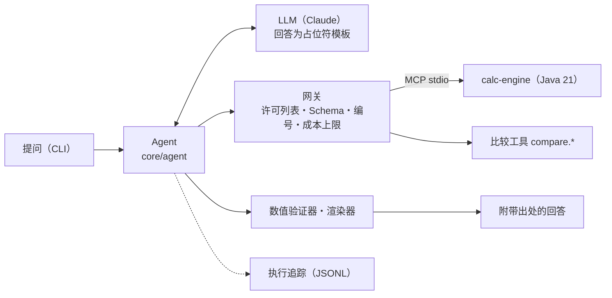

# EchoLab

[日本語](README.md) ｜ [English](README.en.md) ｜ **中文**

*本文为译文，以日文版为准。*

> **不让 AI 做计算的 AI 助手。** 数值由确定性工具计算，AI 只负责理解与说明。
> 以《鸣潮（Wuthering Waves）》角色培养为题材的**非官方、非营利粉丝作品**。

[免责声明](DISCLAIMER.zh-CN.md)

> **使用说明**（附图解和动画，日语・英语・中文）：<https://hexinlong9981.github.io/echolab/zh/>（源文件：[`docs/guide/`](docs/guide/)）
>
> **本地运行指南**（从无需 API 密钥的方式开始）：<https://hexinlong9981.github.io/echolab/local/zh/>

## 这是什么

这是一个 AI 助手，回答声骸评估、伤害比较、抽卡概率这类"只要错一个数字就会失去信任"的问题。
回答中出现的所有数值都来自计算服务，并且可以查看其出处（计算明细）。

## 为什么要做

LLM 会编造看似合理的数值。在业务中使用 AI 时，最常被追问的也是
"这个数字可信吗？"。EchoLab 通过设计来回答这个问题。

| 问题 | EchoLab 的设计 |
|---|---|
| 数值捏造 | 计算只由确定性工具完成。差值、比值、增长率也由比较工具计算，AI 连四则运算都不做。LLM 的回答是通过占位符引用出处 ID 的模板，数值由渲染器填入。只要出现没有出处的数字就退回重写（M2、ADR-0005、ADR-0008） |
| 数据的可靠性 | 未确认的数据也可用于计算，但回答中必定注明"基于未确认的数据"。`verified: true` 在 Schema 中强制要求出处 URL、确认日期和游戏版本（ADR-0006） |
| 实现错误 | 同一组黄金用例在三处核对：Java、Python 参考实现、经由 MCP 的端到端测试 |
| 越权与注入 | 工具调用经过默认拒绝的网关。来自外部的字符串被视为数据而非指令（网关已在 M2 实现，注入评估集在 M4） |
| 质量退化 | 评估数值忠实度。脚本模式的评估在 CI 中对每个 PR 运行；使用真实 LLM 的评估在本地运行，只提交汇总结果（M2。注入评估集在 M4） |
| 成本 | 根据价格表计算每次调用的费用并记入台账，达到每日或每月上限后不再调用 LLM（M2） |

采用将领域无关的核心与"领域包"分离的设计，即使把题材换成房贷试算（M3）等，核心也无需改动（ADR-0003）。

## 当前状态：M2（CLI 纵向切片）

从提问到附带出处的回答，可以在 CLI 中端到端跑通。



| 项目 | 内容 |
|---|---|
| 回答 | LLM 编写模板，用占位符 `[[c1.total\|0]]` 引用数值。数值由渲染器根据出处 ID 确定性地填入（ADR-0008） |
| 验证 | 占位符以外的数字，只允许引用问题中的数值或许可列表中的数字（如列表序号）。不符合则退回，退回超过 2 次后以不含数值的回答结束 |
| 网关 | 只暴露 `domain.yaml` 中声明的工具（默认拒绝）、用 JSON Schema 校验输入、分配调用 ID 与出处 ID、每日与每月的成本上限 |
| 计算 | 将 calc-engine 作为 MCP 服务器（Spring Boot + Spring AI，stdio）公开。期望伤害、声骸评分、抽卡概率（精确解与蒙特卡洛法）。差值、比值、增长率由 `compare.diff`、`compare.ratio` 计算 |
| 未确认数据 | 计算中使用的未确认数据的 ID 会传递到结果中，引用它的回答会自动附加注释（ADR-0006） |
| 评估 | 数值忠实度（不含任何无出处数值的回答所占比例）与退回率。脚本模式的 8 个用例在 CI 中每次运行 |
| 追踪 | 一次提问记录为一个 JSONL 文件（提问、LLM 调用及费用、工具调用、验证判定、回答） |
| 测试 | 黄金用例在 Java、Python 参考实现、经由 MCP 的端到端测试三处核对。Java 有单元测试、性质测试（jqwik）、ArchUnit，Python 使用 pytest |
| 质量门禁 | Error Prone（警告视为错误）、Spotless、JaCoCo（行覆盖率 90% 以上）、ruff |

## 使用方法

### 1. 无需 API 密钥试用（脚本模式）

使用按脚本应答的 LLM，以及由 Python 参考实现计算的测试用计算服务运行。不需要 Java，也不需要 API 密钥。

```bash
python3 -m venv .venv && .venv/bin/pip install -r requirements-dev.txt
.venv/bin/python -m core.agent "ビルド A（攻撃力 2000、スキル倍率 2.5、ダメージバフ 0.3、会心率 0.6、会心ダメージ 2.2、敵の防御 1000、耐性ダウンなし）とビルド B（攻撃力 1800、スキル倍率 3.0、ダメージバフ 0.2、会心率 0.5、会心ダメージ 2.5、敵の防御 1200、耐性ダウン 0.3）では、どちらがどれだけ強い？ どちらも防御定数 1600、防御無視 0、敵の耐性 0.1。" \
  --llm scripted --script core/agent/examples/compare_builds.yaml --fake-backend
```

输出：

```text
ビルド B の方が強いです。
- ビルド A の期待ダメージ: 6,192
- ビルド B の期待ダメージ: 7,128
- 差: 936（A に比べて 15.1% 増加）

出典:
出典 ID    値           ツール           未確認データ
---------  -----------  ---------------  ------------
c1.total   6192.000000  damage.expected  -
c2.total   7128.000000  damage.expected  -
c3.diff    936.000000   compare.diff     -
c4.change  0.151163     compare.ratio    -

状態: answered　差し戻し: 1 回　費用: $0.0000　実行 ID: 20261003T024533Z-ab0ef9
トレース: .echolab/traces/20261003T024533Z-ab0ef9.jsonl
```

该脚本的第 1 版草稿因自行写出差值"936"而被退回。第 2 版通过比较工具求出差值与增长率，
并用占位符引用，从而通过验证（差し戻し: 1 回 即退回 1 次）。

### 2. 使用真实的计算服务（Java）

去掉 `--fake-backend` 后，会按照 `config/services.yaml` 将 calc-engine 的 MCP 服务器（jar）作为子进程启动。
需要 JDK 21（若 `PATH` 中没有 `java`，则使用 `JAVA_HOME/bin/java`）。

```bash
(cd services/calc-engine && ./gradlew bootJar)   # build/libs/calc-engine-mcp.jar
.venv/bin/python -m core.agent "（質問）" --llm scripted --script core/agent/examples/compare_builds.yaml
```

### 3. 使用真实的 LLM（Claude）

默认的 `--llm anthropic` 会调用 Claude API（`claude-opus-5-5`）。

```bash
export ANTHROPIC_API_KEY=...
.venv/bin/python -m core.agent "攻撃力 2000、スキル倍率 2.5、ダメージバフ 0.3、会心率 0.6、会心ダメージ 2.2、防御定数 1600、敵の防御 1000、防御無視 0、敵の耐性 0.1、耐性ダウン 0 のときの期待ダメージは？"
```

- 成本上限为**每日 1 USD、每月 10 USD**（`config/budget.yaml`，按 UTC 划分）。每次调用 LLM 前都会检查，若已达上限则不调用直接结束。
- 用量与金额追加记录到 `.echolab/costs.jsonl`。上限可通过环境变量 `ECHOLAB_DAILY_USD`、`ECHOLAB_MONTHLY_USD` 修改。
- 执行追踪保存在 `.echolab/traces/<执行 ID>.jsonl`（两者均不纳入 Git 管理）。

### 评估与测试

```bash
.venv/bin/python -m core.evals                       # 数值忠实度（脚本模式，无需 API 密钥）
.venv/bin/python -m core.evals --llm anthropic --out evals/reports/<名称>.md   # 真实 LLM（在本地手动运行）
.venv/bin/ruff check . && .venv/bin/pytest -m "not e2e"
```

Java 的测试、静态分析、覆盖率，以及端到端测试（`pytest -m e2e`）的运行方法见
[services/calc-engine/README.zh-CN.md](services/calc-engine/README.zh-CN.md) 与 [tests/README.zh-CN.md](tests/README.zh-CN.md)。
也可以不安装 JDK，只用 Docker 构建和测试 Java。

```bash
cd services/calc-engine
docker run --rm -u "$(id -u):$(id -g)" -e GRADLE_USER_HOME=/cache \
  -v "$HOME/.gradle-echolab:/cache" -v "$(cd ../.. && pwd):/w" -w /w/services/calc-engine \
  gradle:8-jdk21 ./gradlew check
```

## 目录结构

```
core/          领域无关的核心（Python）：契约・网关・比较工具・验证器・Agent 与 CLI・追踪・评估
config/        工具服务的启动方式（services.yaml）・成本上限与价格表（budget.yaml）
domains/wuwa/  领域包①：鸣潮（domain.yaml・黄金用例・示例数据・提示词）
services/      calc-engine（Java 21。计算库与 MCP 服务器）
evals/         评估用例（faithfulness/）与汇总报告（reports/）
tests/         跨仓库的测试（Schema 检查・参考实现・core 单元测试・端到端测试）
docs/          架构与 ADR
```

仓库中只放已实现的部分。今后的目录（`web/`、`domains/mortgage/` 等）在实现时再创建，计划只写在
[docs/architecture.zh-CN.md 的路线图一节](docs/architecture.zh-CN.md#路线图与今后的结构)中（ADR-0007）。
M2 的组件与契约见 ADR-0008。
详情请参阅 [docs/architecture.zh-CN.md](docs/architecture.zh-CN.md) 与 [docs/adr/zh-CN/](docs/adr/zh-CN/) 中的 ADR。

## 路线图

| 阶段 | 内容 | 状态 |
|---|---|---|
| M1 | Java calc-engine・黄金用例・CI | ✅ 完成 |
| M2 | 纵向切片：在 CLI 中实现"提问 → 网关（许可列表・Schema・成本上限）→ calc-engine（MCP）→ 数值追踪验证器・比较工具 → 附带出处的回答"。数值忠实度评估・执行追踪 | ✅ 完成 |
| M3 | 领域包②：房贷试算（最小示例）。在 CI 中检查"核心差异为零" | 计划中 |
| M4 | 截图识别・注入评估集（以脚本模式加入 CI，真实 LLM 在本地运行） | 计划中 |
| M5 | Web UI・追踪回放・评估仪表盘・公开演示 | 计划中 |

该顺序的理由见 ADR-0007（在横向扩展功能之前，先打通端到端）。

## 关于数据

`domains/wuwa/data` 中的数值是手工整理的**示例值**，`verified: false` 的条目为未确认。
在回答中使用由未确认数据计算出的数值时，必定加以注明（ADR-0006）。
黄金用例的设计使期望值只由明确给出的输入值决定，不依赖游戏的官方数值。
计算公式（防御、抗性乘区等）也是通用模型，未与游戏的实际公式核对。

## 许可证

代码采用 [MIT License](LICENSE)。与游戏及作品相关的权利归各权利人所有（[免责声明](DISCLAIMER.zh-CN.md)）。
