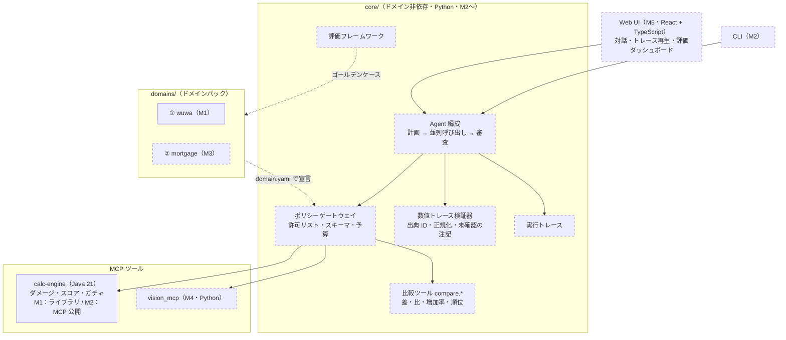
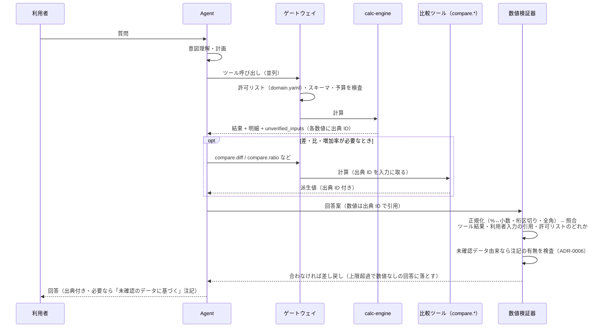

# アーキテクチャ

EchoLab は「**数値は決定的なツールで計算し、AI は理解と説明だけを担う**」AI アシスタントです（ADR-0001）。

## 全体像

実線の枠は実装済み、点線の枠は予定です（括弧内は実装するマイルストーン）。

## 1 回の質問の流れ（M2 以降）

検証器の規則は ADR-0005 にあります。要点は次のとおりです。

| 規則 | 内容 |
|---|---|
| LLM は計算しない | 四則演算も含め、派生値は `core` の比較ツール（ドメイン非依存）で計算する |
| 出典 ID | ツール結果の各数値に `<呼び出しID>.<フィールド>` を振り、回答はそれを引用して組み立てる |
| 許される数値 | ツール結果の値・利用者入力の引用・数値でない語に含まれる数字（許可リスト）だけ |
| 丸め | ツール結果を表示桁数に丸めた値と一致する場合だけ許す（「約」は表示桁数の宣言） |
| 未確認データ | `unverified_inputs` を伝搬し、引用する回答には注記を必須にする（ADR-0006） |

## 現在の状態（M1）

実装済みなのは次のものだけです。リポジトリには実装済みの部分のディレクトリしか置きません（ADR-0007）。

| 場所 | 内容 |
|---|---|
| `services/calc-engine` | Java 21 の計算ライブラリ（Spring・MCP なし、ADR-0004） |
| `domains/wuwa` | `domain.yaml`・ゴールデンケース（`derivation` 付き）・未確認のサンプルデータ（`verified: false`） |
| `tests/` | ゴールデンケース・ドメインデータ・`domain.yaml` のスキーマ検査と、Python 参照実装による照合 |
| `.github/workflows` | `test.yml`（ruff・pytest）と `java.yml`（`./gradlew check`） |

ゴールデンケースの各ケースには `derivation`（`hand`：手計算／`closed_form`：閉じた式／`reference`：参照実装の出力）を書き、
各ツールに `reference` 以外のケースを 1 つ以上置きます（参照実装との循環を避けるため）。
`domain.yaml` は `tests/schemas/domain.schema.json` で検査します（`tests/test_domain_manifest.py`）。

## ロードマップと今後の構成

方針は ADR-0007 です。機能を横に広げる前に、端から端までを先に通します。
未実装の部分のディレクトリは作らず、計画はこの節にだけ書きます。ディレクトリは実装するときに作ります。

| 段階 | 内容 | 状態 |
|---|---|---|
| M1 | calc-engine（Java）・ゴールデンケース・CI | 完了 |
| M2 | 縦の切片：CLI → ゲートウェイ → calc-engine（MCP）→ 数値トレース検証器 → 出典付きの回答。数値の忠実度の評価・実行トレース | 予定 |
| M3 | ドメインパック②：住宅ローン試算（最小例）。「コアの差分ゼロ」を CI で検査 | 予定 |
| M4 | スクリーンショット読み取り・注入の評価セット・評価パイプラインの CI 化 | 予定 |
| M5 | Web UI・トレース再生・評価ダッシュボード・デモ公開 | 予定 |

### M2：縦の切片（質問 → 出典付きの回答）

`core/` を作ります。ここには鳴潮・住宅ローンといったドメインの概念を一切持ち込みません。
ドメインごとの知識は `domains/<名前>/domain.yaml` で宣言され、コアはそれを読むだけです（ADR-0003）。

| 予定の場所 | 役割 |
|---|---|
| `core/agent/` | 編成：計画 → 並列ツール呼び出し → 数値検証 → 審査。モデル抽象層（`llm/`）を含む。入口は CLI |
| `core/gateway/` | ポリシーゲートウェイ：`domain.yaml` の許可リスト（既定拒否）・入出力のスキーマ検証・予算（日次・月次のコスト上限） |
| `core/verifier/` | 数値トレース検証器（ADR-0005） |
| `core/compare/` | 比較ツール（`compare.diff`・`compare.ratio` など）。ドメイン非依存で、ゴールデンケースで検証する |
| `core/evals/` | 評価：ゴールデンケースの実行と「数値の忠実度」（出典のない数値を含む回答の割合） |
| `core/trace/` | 実行トレース：まず `events.jsonl` に書き、後で Postgres に移す |
| `services/calc-engine` | MCP として公開する（ここで Spring Boot を導入、ADR-0004）。結果に `unverified_inputs` を付ける（ADR-0006） |

外部から来た文字列（ツール結果・利用者入力）は、指示ではなくデータとして扱います。

### M3：ドメインパック②：住宅ローン試算（最小例）

「コアを 1 行も変えずに、約 300 行で新しいドメインを追加できる」ことを示すための最小例です（ADR-0003）。

- `domains/mortgage/`：元利均等・元金均等の比較と、繰上返済の効果を計算する（`calc/`、Python）。`golden/`・`prompts/`・`domain.yaml` を持つ。
- このパックを足す変更で `core/` の差分がゼロであることを CI で検査する。
- **計算例であり、金融上の助言ではありません。** README と回答にもそう表示します。

### M4：スクリーンショット読み取りと評価パイプライン

| 予定の場所 | 役割 |
|---|---|
| `servers/vision_mcp/` | スクリーンショット → 構造化 JSON（スキーマ検証付き、Python） |
| `evals/redteam/` | プロンプトインジェクションの評価問題（合成したスクリーンショットを含む。ゲームの画像は使わない） |
| `evals/reports/` | 評価結果と推移（集計済みのものだけをコミット） |

評価セット（ゴールデンケース・注入の評価問題）を LLM 込みで PR ごとに流すワークフローを CI に加えます。

### M5：Web UI

`web/`（React + TypeScript）。対話、実行トレースの再生（React Flow）、評価ダッシュボードを持ちます。
Vite でビルドした静的ファイルを Cloudflare Pages に置きます。

## 言語の分担

| 部分 | 言語 | 理由 |
|---|---|---|
| 計算サービス | Java 21 | 型による網羅性・`BigDecimal`・並列性能（ADR-0002） |
| エージェント・評価・比較ツール | Python | AI と評価の道具が充実している |
| 画面 | TypeScript（React） | 対話 UI・フロー図の部品が充実している |

言語の間の契約はゴールデンケースの形式（`tests/schemas/golden.schema.json`）です。
コアとドメインパックの間の契約は `domain.yaml` の形式（`tests/schemas/domain.schema.json`）です。
