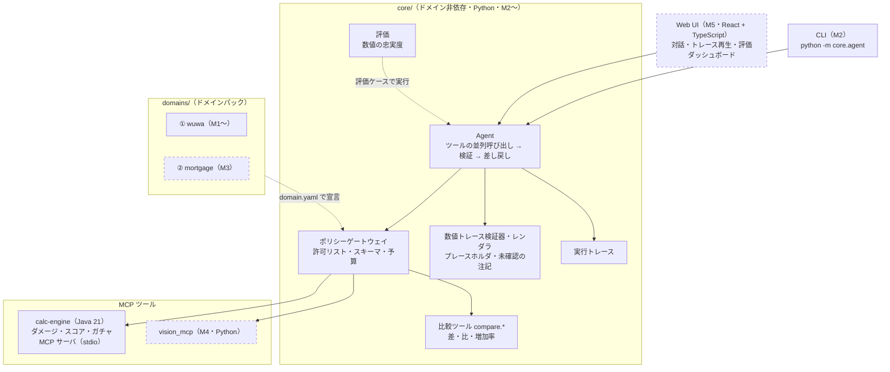
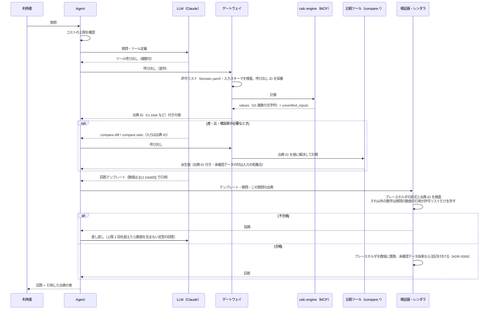

**日本語** ｜ [English](architecture.en.md) ｜ [中文](architecture.zh-CN.md)

# アーキテクチャ

EchoLab は「**数値は決定的なツールで計算し、AI は理解と説明だけを担う**」AI アシスタントです（ADR-0001）。

## 全体像

実線の枠は実装済み（M1・M2）、点線の枠は予定です（括弧内は実装するマイルストーン）。

## 1 回の質問の流れ

検証器の方針は ADR-0005、プレースホルダ方式と部品間の契約は ADR-0008 にあります。要点は次のとおりです。

| 規則 | 内容 |
|---|---|
| LLM は計算しない | 四則演算も含め、派生値は `core` の比較ツール（ドメイン非依存）で計算する |
| LLM は数値を書かない | 回答はテンプレートで、数値はプレースホルダ `[[<出典 ID>]]`・`[[<出典 ID>\|<書式>]]` で引用する。数値はレンダラが決定的に埋める |
| 出典 ID | ゲートウェイがツール結果の各数値に `<呼び出し ID>.<フィールド>`（例 `c1.total`）を振る。計算サービスは ID を知らない |
| 許される数字 | プレースホルダ以外では、質問にある数値の引用（桁区切り・`%` を正規化）と許可リスト（箇条書きの番号、10 以下の整数 + 助数詞。日本語の「つ・点・種類・位・番目」、中国語の「个・种・项・条・步」、英語の ways・points・steps などの名詞）だけ |
| 書式 | 省略時は小数 2 桁まで、`N` は小数 N 桁、`%N` は百分率で小数 N 桁。丸めは ROUND_HALF_EVEN |
| 未確認データ | `unverified_inputs` を出典に伝搬し、引用した回答にはレンダラが注記を付ける（ADR-0006） |

## 現在の状態（M2）

M1（計算サービス）と M2（CLI の縦の切片）が実装済みです。リポジトリには実装済みの部分のディレクトリしか置きません（ADR-0007）。

| 場所 | 内容 |
|---|---|
| `core/` | ドメイン非依存のコア（Python）。部品は次の節の表のとおり |
| `config/` | `services.yaml`（ツールサービスの起動方法）・`budget.yaml`（コストの上限と料金表） |
| `services/calc-engine` | Java 21 の計算ライブラリ（`dev.echolab.calc`、フレームワーク非依存）と MCP サーバ（`dev.echolab.app`、ADR-0004） |
| `domains/wuwa` | `domain.yaml`・ゴールデンケース（`derivation` 付き）・未確認のサンプルデータ（`verified: false`）・プロンプト |
| `evals/` | 数値の忠実度の評価ケース（`faithfulness/cases.yaml`）と集計済みのレポート（`reports/`） |
| `tests/` | スキーマ検査・Python 参照実装による照合・`core` の単体テスト（`tests/core/`）・端から端までの試験（`tests/e2e/`） |
| `.github/workflows` | `test.yml`（ruff・pytest・台本モードの評価、jar を起動する端から端までの試験）と `java.yml`（`./gradlew check`・`bootJar`） |

ゴールデンケースの各ケースには `derivation`（`hand`：手計算／`closed_form`：閉じた式／`reference`：参照実装の出力）を書き、
各ツールに `reference` 以外のケースを 1 つ以上置きます（参照実装との循環を避けるため）。
ドメインのゴールデンケースは Java の契約テスト・Python の参照実装・MCP 経由の端から端までの試験の 3 か所で照合します。
比較ツールのゴールデンケースは `core/golden/` にあり、`core.compare` と照合します。
`domain.yaml` は `tests/schemas/domain.schema.json` で検査します（`tests/test_domain_manifest.py`）。

## ロードマップと今後の構成

方針は ADR-0007 です。機能を横に広げる前に、端から端までを先に通します。
未実装の部分のディレクトリは作らず、計画はこの節にだけ書きます。ディレクトリは実装するときに作ります。

| 段階 | 内容 | 状態 |
|---|---|---|
| M1 | calc-engine（Java）・ゴールデンケース・CI | 完了 |
| M2 | 縦の切片：CLI → ゲートウェイ → calc-engine（MCP）→ 数値トレース検証器 → 出典付きの回答。数値の忠実度の評価・実行トレース | 完了 |
| M3 | ドメインパック②：住宅ローン試算（最小例）。「コアの差分ゼロ」を CI で検査 | 予定 |
| M4 | スクリーンショット読み取り・注入の評価セット（台本モードを CI に追加） | 予定 |
| M5 | Web UI・トレース再生・評価ダッシュボード・デモ公開 | 予定 |

### M2：縦の切片（質問 → 出典付きの回答）：実装済み

`core/` には鳴潮・住宅ローンといったドメインの概念を一切持ち込みません。
ドメインごとの知識は `domains/<名前>/domain.yaml` で宣言され、コアはそれを読むだけです（ADR-0003）。
部品の分け方と境界の契約は ADR-0008 にあります。

| 場所 | 役割 |
|---|---|
| `core/contracts.py` | 部品間の契約：ツールの結果（`ToolEnvelope`）・ツールサービスの接続（`ToolBackend`）・出典つきの値（`SourceValue`）・プレースホルダの形式 |
| `core/gateway/gateway.py` | LLM とツールの間の唯一の入口：`domain.yaml` の許可リスト（既定拒否）・入力の JSON Schema 検証・呼び出し ID と出典 ID の採番・比較ツールの出典 ID の解決 |
| `core/gateway/mcp_backend.py` | stdio の MCP クライアント。`config/services.yaml` のとおりにサービスを子プロセスとして起動する。1 回の呼び出しの応答を待つ上限は 30 秒 |
| `core/gateway/budget.py` | コストの台帳（`.echolab/costs.jsonl`）と日次・月次の上限（既定 1 USD・10 USD、UTC で区切る）。料金表に無いモデルの課金は、表の最高料金で見積もる |
| `core/compare/` | 比較ツール `compare.diff`（差）・`compare.ratio`（比と増加率）。入力は出典 ID だけ。精度の方針は calc-engine と同じ（有効桁 16・小数 6 桁・ROUND_HALF_EVEN） |
| `core/verifier/` | 回答テンプレートの検証（`verify.py`）と、プレースホルダを数値に置き換えるレンダラ（`render.py`） |
| `core/agent/` | Agent の往復（`loop.py`）・CLI（`python -m core.agent`）・LLM の抽象（`llm/`：Claude と台本の LLM）・コアのシステムプロンプト（`prompts/core.md`） |
| `core/trace/` | 実行トレース。1 回の質問を `.echolab/traces/<実行 ID>.jsonl` に記録する |
| `core/evals/`・`evals/` | 数値の忠実度の評価（`python -m core.evals`）。ケースは `evals/faithfulness/cases.yaml` |
| `services/calc-engine`（`dev.echolab.app`） | Spring Boot + Spring AI の MCP サーバ（同期・stdio）。`calc` の公開 API を呼ぶだけで、計算式は持たない。結果に `unverified_inputs` を付ける（ADR-0006） |

Agent の往復は次のとおりです。

1. LLM を呼ぶ前に毎回コストの上限を確認する。上限に達していれば LLM を呼ばずに終える。
2. LLM が求めたツール呼び出しはゲートウェイで並列に実行し、結果（出典 ID 付きの値）を 1 つのメッセージで返す。
   ツールの入力の誤りは例外にせず、エラーの結果として LLM に返して呼び直させる。
3. ツールを呼ばずに返したテキストを回答テンプレートとみなし、検証器にかける。不合格なら指摘を付けて差し戻す。
   差し戻しが 2 回を超えたら、数値を含まない定型の回答で終える。
4. ツールを呼ぶ往復は 1 回の質問あたり 6 回まで。LLM の拒否（`refusal`）・出力の打ち切り（`max_tokens`）では、途中のツール呼び出しを実行せずに終える。

LLM は Claude（`claude-opus-5-5`）で、抽象層（`core/agent/llm/`）を挟んでいます。テスト・CI・デモでは台本どおりに応答する LLM
（`ScriptedLLM`）を使い、API キーなしで同じ往復を再現します。

**数値の忠実度**は「利用者に返した回答のうち、出典の無い数値を 1 つも含まないものの割合」です。
検証に通った回答はテンプレートを検証器でもう一度検査し、定型の回答は数字を含まないことを確かめます。仕組み上 1.0 になることを確かめる指標です。
あわせて差し戻し率（差し戻した下書き / 下書き）と費用を集計します。

- 台本モードの評価（8 ケース）は pytest から CI で毎回実行し、集計結果を `evals/reports/scripted-baseline.md` と照合します。
- 実物の LLM による評価（`--llm anthropic`）は手元で手動で実行し、集計したレポートだけを `evals/reports/` にコミットします。生の記録（`evals/reports/raw/`）はコミットしません。
- CI は API キーを持ちません。

外部から来た文字列（ツール結果・利用者入力）は、指示ではなくデータとして扱います。

### M3：ドメインパック②：住宅ローン試算（最小例）

「コアを 1 行も変えずに、約 300 行で新しいドメインを追加できる」ことを示すための最小例です（ADR-0003）。

- `domains/mortgage/`：元利均等・元金均等の比較と、繰上返済の効果を計算する（`calc/`、Python）。`golden/`・`prompts/`・`domain.yaml` を持つ。
- このパックを足す変更で `core/` の差分がゼロであることを CI で検査する。
- **計算例であり、金融上の助言ではありません。** README と回答にもそう表示します。

### M4：スクリーンショット読み取りと評価パイプライン

| 予定の場所 | 役割 |
|---|---|
| `servers/vision_mcp/` | スクリーンショット → 構造化 JSON（スキーマ検証付き、Python） |
| `evals/redteam/` | プロンプトインジェクションの評価問題（合成したスクリーンショットを含む。ゲームの画像は使わない） |

M2 と同じ分担にします。CI は API キーを持たず、台本モードの評価と端から端までの試験だけを実行します。
実物の LLM による評価は手元で手動で実行し、集計したレポートだけを `evals/reports/` にコミットします。

### M5：Web UI

`web/`（React + TypeScript）。対話、実行トレースの再生（React Flow）、評価ダッシュボードを持ちます。
Vite でビルドした静的ファイルを Cloudflare Pages に置きます。

## 言語の分担

| 部分 | 言語 | 理由 |
|---|---|---|
| 計算サービス | Java 21 | 型による網羅性・`BigDecimal`・並列性能（ADR-0002） |
| エージェント・評価・比較ツール | Python | AI と評価の道具が充実している |
| 画面 | TypeScript（React） | 対話 UI・フロー図の部品が充実している |

言語の間の契約はゴールデンケースの形式（`tests/schemas/golden.schema.json`）です。
コアとドメインパックの間の契約は `domain.yaml` の形式（`tests/schemas/domain.schema.json`）です。
コアと計算サービスの間の契約は、MCP の結果の JSON（`core/contracts.py` の `ToolEnvelope`、ADR-0008）です。

## 既知の制約

M2 の時点での制約と、その影響の範囲です。

| 項目 | 内容 |
|---|---|
| 同じサービスへの呼び出しは直列 | Agent はツール呼び出しを並列に発行しますが、`McpStdioBackend` は同じサービスへの呼び出しを 1 本ずつ送ります。MCP Java SDK の stdio の転送は、起動直後に並行して応答を書き出すと応答を失うことがあるためです。計算は数ミリ秒で終わるので、待ち時間への影響はほぼありません |
| コストの上限は呼び出しの前に確認する | 上限は LLM を呼ぶ前に確認します。1 回の呼び出しの費用は応答を受け取るまで分からないため、最後の 1 回の分だけ上限をわずかに超えることがあります |
| コストの台帳はローカルの JSONL | 台帳（`.echolab/costs.jsonl`）は 1 台・1 利用者での使用を前提にしたファイルで、プロセスをまたぐ排他制御はしていません。複数のプロセスを同時に動かすと、上限の判定が互いの使用分を見落とすことがあります |
| 検証器が見る数字の範囲 | 検証器が数値として検出するのはアラビア数字（全角を含む）です。漢数字（「三」など）は検出しません。また、質問にある数値と等しい数字は、どの文脈で使われていても引用として許します |
| サンプルデータは未確認 | `domains/wuwa/data` の値は未確認のサンプル（`verified: false`）です。これを使った回答には注記が付きます（ADR-0006） |
